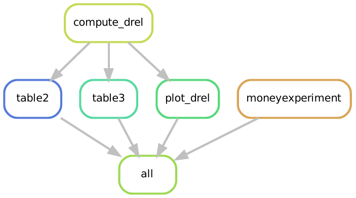

# Replication: Concentration Bias in Intertemporal Choice

Original Paper: 
Concentration Bias in Intertemporal Choice 
Markus Dertwinkel-Kalt, Holger Gerhardt, Gerhard Riener, Frederik Schwerter, Louis Strang
The Review of Economic Studies, Volume 89, Issue 3, May 2022, Pages 1314–1334, [https://doi.org/10.1093/restud/rdab043](https://academic.oup.com/restud/article-abstract/89/3/1314/6375961
)

Replicators:

* Lachlan Deer (@lachlandeer)
* Sigmund Ellingsrud  
* Felix Heuer
* Amund Kordt

## Installation Instructions for an Ubuntu System

Follow these Steps to install the necessary software on your system

You need to have the following software and packages installed:

1. Python 3 (Python 3.6 or higher)
2. Snakemake (we'll install the correct version in a couple of lines time!)
3. R (version 4.0.x)

### Installing Python

Either:

1. Install Anaconda Python:
    - We provide instructions on how to install anaconda python [here](https://pp4rs.github.io/2020-uzh-installation-guide/python/)
2. Install Python using the deadsnakes ppa:
    - Here's how to add the deadsnakes ppa and install Python 3.8
    ```bash
    $ sudo apt-get install software-properties-common
    $ sudo add-apt-repository ppa:deadsnakes/ppa
    $ sudo apt-get update
    $ sudo apt-get install python3.8
    ```

### Installing Snakemake

We have included a `requirements.txt` file that we can use to install a specific version of snakemake.
This makes sure that our example runs on your machine (or at least won't break because you use a different version of snakemake than we do)

``` bash
pip3 install -r requirements.txt
```

you may need to replace `pip3` with `pip`

**Note:** In recent versions of Snakemake you must state how many cores you want to use when executing rules. 
In this example, we encourage the use of a single core, so when we use snakemake we will always write it as `snakemake --cores 1 <something>`.
More cores speeds things up, but our example is quite light so it seems unnecessary.

### Installing `R`

Instructions on how to install R [here](https://cran.r-project.org/)

### Install the Required `R` libraries

We utilize many additional R packages inside the scripts that build our project.
To ensure that our project runs on every machine without issues relating to R packages not being installed we utilize `renv` to control the list of packages needed to run this example, and to monitor the version of the package we use.

Once you have completed the installation instructions above, install open R and install `renv`:

```r
install.packages("renv")
```

Now exit R, and direct your terminal to the project's working directory.

You will need to provide consent for `renv` to be able to write files to your system:

``` bash
snakemake --cores 1 renv_consent
```

Now we will install the necessary packages (and their precise versions) which are stored in the `renv.lock` file:

``` bash
snakemake --cores 1 renv_restore
```

This will install all the packages we need. It may take a while.

## Running the Code:

All outputs can be produced with the following command executed from a terminal when you are located in this project's working directory

```
snakemake --cores 1 all 
```

Note that you must be in this project's working directory when running the snakemake command. For example,:

```bash
YOUR/FILE/PATH/concentration-bias-replication$ snakemake --cores 1 all 
```

## Visualization of the Workflow

Snakemake workflows are a directed acyclic graph (DAG).
We can visualize the relationship between the rules (a simplified view of the DAG) in our workflow:


